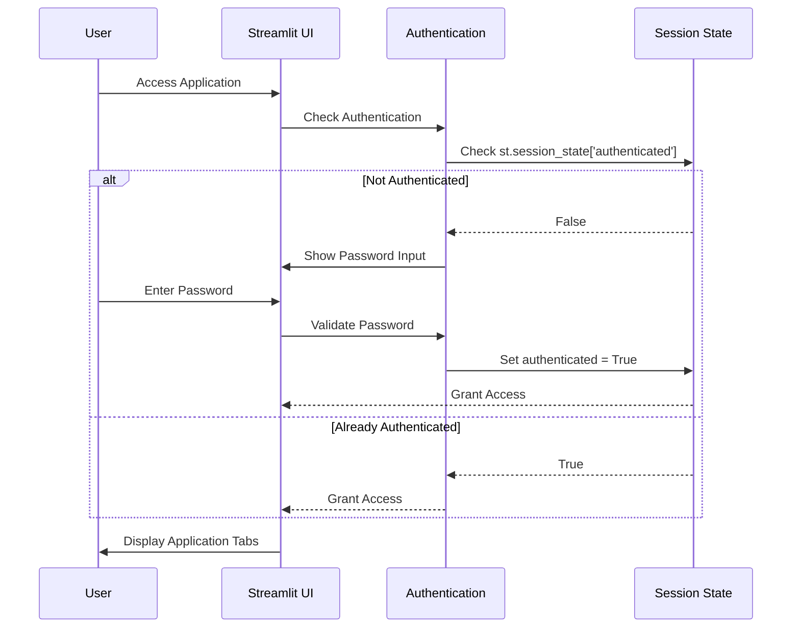
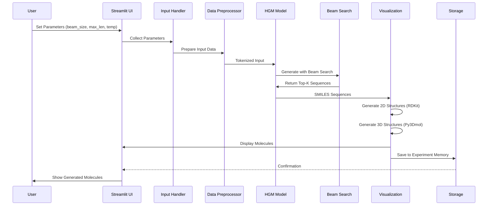
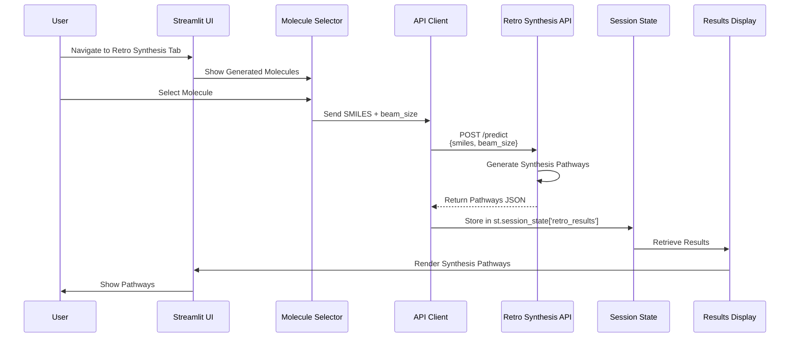
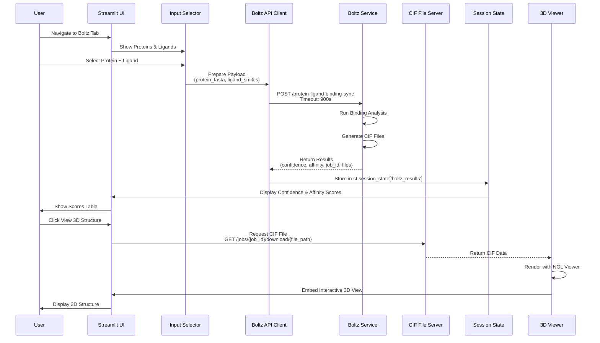
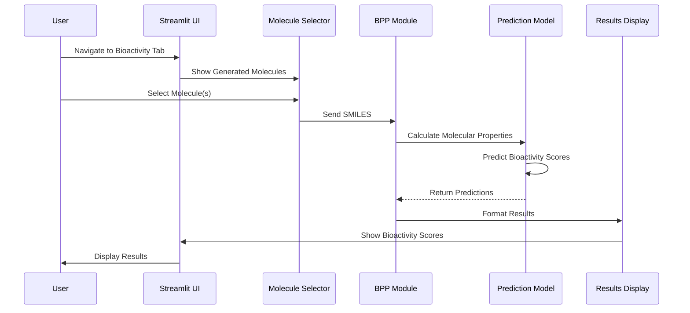
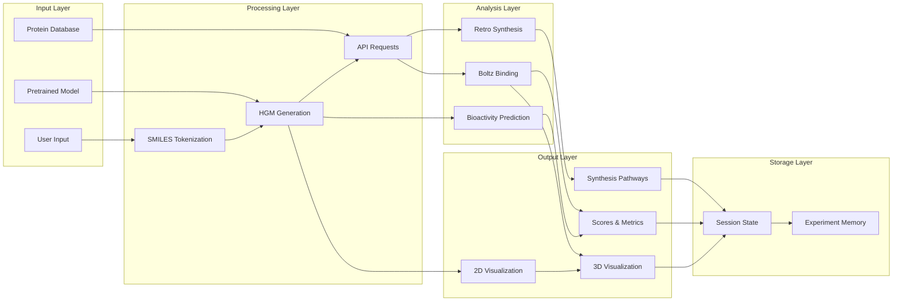
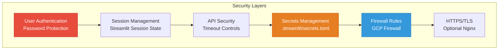
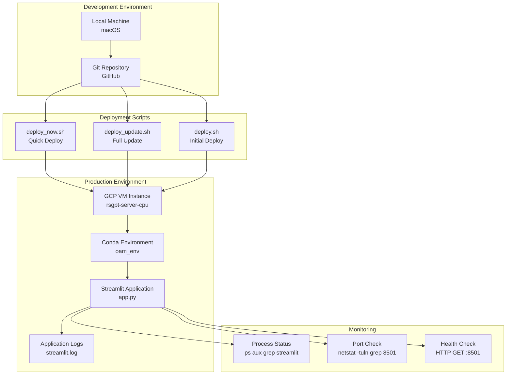
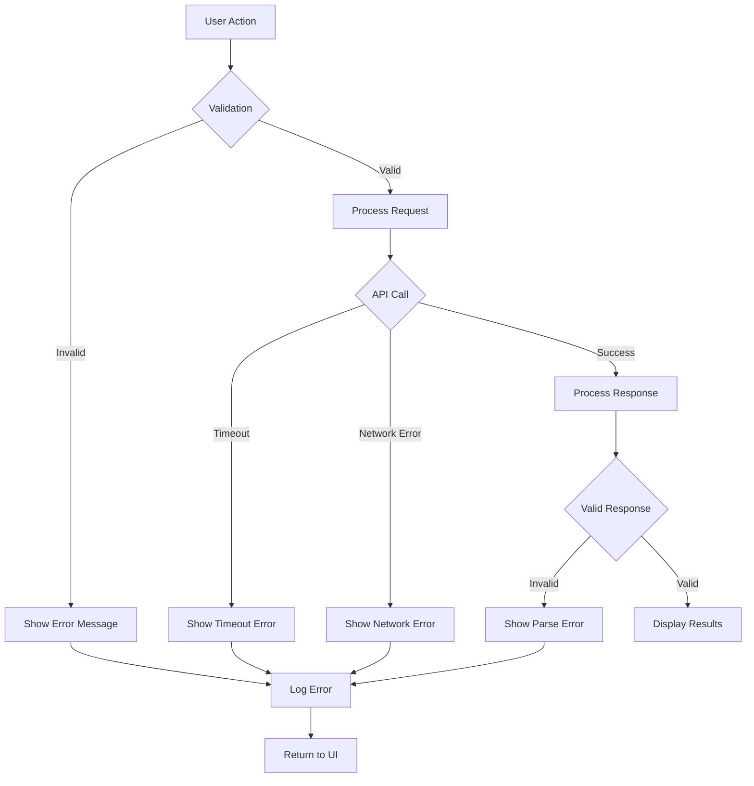

# HGM Project Architecture

## System Architecture Diagram

```mermaid
graph TB
    subgraph "User Interface Layer"
        UI[Streamlit Web Application<br/>Port 8501]
    end

    subgraph "Core Application - app.py"
        AUTH[Authentication Module<br/>Password Protection]
        TABS[Tab Navigation System]
        
        subgraph "Tab 1: Molecule Generation"
            INPUT[Input Parameters<br/>- Beam Size<br/>- Max Length<br/>- Temperature]
            HGM[Hierarchical Generative Model<br/>LSTM/GRU with Attention]
            BEAM[Beam Search Algorithm]
            SAMPLE[Sampling Module]
            VIZ2D[2D Molecule Visualization<br/>RDKit]
            VIZ3D[3D Molecule Visualization<br/>Py3Dmol]
        end
        
        subgraph "Tab 2: Retro Synthesis"
            RS_INPUT[SMILES Input Selection]
            RS_API[Retro Synthesis API Client]
            RS_VIZ[Synthesis Pathway Display]
        end
        
        subgraph "Tab 3: Boltz Analysis"
            BOLTZ_INPUT[Protein-Ligand Selection<br/>- Protein FASTA<br/>- Ligand SMILES]
            BOLTZ_API[Boltz API Client<br/>15min timeout]
            BOLTZ_RESULTS[Results Display<br/>- Confidence Scores<br/>- Affinity Scores<br/>- Kd Values]
            BOLTZ_3D[3D Structure Viewer<br/>NGL Viewer + CIF Files]
        end
        
        subgraph "Tab 4: Bioactivity Prediction"
            BPP_INPUT[Molecule Selection]
            BPP_MODULE[Bioactivity Prediction Pipeline<br/>bpp/]
            BPP_RESULTS[Bioactivity Scores Display]
        end
    end

    subgraph "Data Processing Layer"
        PREPROCESS[Data Preprocessing<br/>funcs/data_processing.py]
        SMILES[SMILES Processing<br/>funcs/smiles_utils.py]
        TOKENIZER[SMILES Tokenizer]
    end

    subgraph "Model Layer"
        PRETRAINED[Pretrained Model<br/>c24_augmentationx10.h5<br/>LSTM-based Generator]
        CONFIG[Model Configuration<br/>configs/]
    end

    subgraph "External Services"
        RS_SERVICE[Retro Synthesis Service<br/>External API<br/>POST /predict]
        BOLTZ_SERVICE[Boltz Binding Service<br/>External API<br/>POST /protein-ligand-binding-sync]
        BOLTZ_FILES[CIF File Server<br/>GET /jobs/{id}/download/{path}]
    end

    subgraph "Storage & State"
        SESSION[Streamlit Session State<br/>- Retro Synthesis Results<br/>- Boltz Results<br/>- Generated Molecules]
        MEMORY[Experiment Memory<br/>memory/ directory<br/>- Generated SMILES<br/>- Experiment Metadata]
        RESOURCES[Static Resources<br/>resources/<br/>- Protein FASTA files<br/>- Images<br/>- Icons]
    end

    subgraph "Deployment Infrastructure"
        GCP[Google Cloud Platform<br/>VM: rsgpt-server-cpu<br/>Zone: us-central1-a]
        FIREWALL[Firewall Rules<br/>Port 8501 Open]
        CONDA[Conda Environment<br/>oam_env<br/>Python 3.10]
    end

    %% User Flow
    UI --> AUTH
    AUTH --> TABS
    
    %% Tab 1 Flow
    TABS --> INPUT
    INPUT --> HGM
    HGM --> PRETRAINED
    HGM --> BEAM
    HGM --> SAMPLE
    BEAM --> VIZ2D
    SAMPLE --> VIZ2D
    VIZ2D --> VIZ3D
    VIZ2D --> MEMORY
    
    %% Tab 2 Flow
    TABS --> RS_INPUT
    RS_INPUT --> RS_API
    RS_API --> RS_SERVICE
    RS_SERVICE --> RS_API
    RS_API --> SESSION
    SESSION --> RS_VIZ
    
    %% Tab 3 Flow
    TABS --> BOLTZ_INPUT
    BOLTZ_INPUT --> BOLTZ_API
    BOLTZ_API --> BOLTZ_SERVICE
    BOLTZ_SERVICE --> BOLTZ_API
    BOLTZ_API --> SESSION
    SESSION --> BOLTZ_RESULTS
    BOLTZ_RESULTS --> BOLTZ_3D
    BOLTZ_3D --> BOLTZ_FILES
    
    %% Tab 4 Flow
    TABS --> BPP_INPUT
    BPP_INPUT --> BPP_MODULE
    BPP_MODULE --> BPP_RESULTS
    
    %% Data Processing
    INPUT --> PREPROCESS
    PREPROCESS --> SMILES
    SMILES --> TOKENIZER
    TOKENIZER --> HGM
    
    %% Configuration
    CONFIG --> HGM
    CONFIG --> BPP_MODULE
    
    %% Resources
    RESOURCES --> BOLTZ_INPUT
    
    %% Deployment
    GCP --> CONDA
    CONDA --> UI
    FIREWALL --> UI
    
    style UI fill:#4A90E2,stroke:#2E5C8A,color:#fff
    style HGM fill:#E94B3C,stroke:#A33327,color:#fff
    style RS_SERVICE fill:#50C878,stroke:#2E7D4E,color:#fff
    style BOLTZ_SERVICE fill:#9B59B6,stroke:#6C3483,color:#fff
    style SESSION fill:#F39C12,stroke:#B9770E,color:#fff
    style GCP fill:#4285F4,stroke:#1967D2,color:#fff
```

---

## Detailed Component Flow

### 1. **User Authentication Flow**



---

### 2. **Molecule Generation Flow**



---

### 3. **Retro Synthesis Flow**



---

### 4. **Boltz Binding Analysis Flow**



---

### 5. **Bioactivity Prediction Flow**



---

## Technology Stack

### **Frontend**
- **Streamlit**: Web application framework
- **RDKit**: 2D molecule visualization
- **Py3Dmol**: 3D molecule visualization
- **NGL Viewer**: Protein-ligand 3D structure visualization
- **Plotly**: Interactive charts and graphs
- **Pandas**: Data manipulation and display

### **Backend**
- **Python 3.10**: Core language
- **TensorFlow/Keras**: Deep learning framework
- **NumPy**: Numerical computations
- **Requests**: HTTP API client

### **Model Architecture**
- **LSTM/GRU**: Recurrent neural networks
- **Attention Mechanism**: Sequence-to-sequence attention
- **Beam Search**: Decoding algorithm
- **Temperature Sampling**: Stochastic generation

### **External APIs**
- **Retro Synthesis API**: Synthesis pathway generation
- **Boltz API**: Protein-ligand binding prediction
- **CIF File Server**: 3D structure file delivery

### **Infrastructure**
- **Google Cloud Platform**: Cloud hosting
- **Ubuntu 22.04**: Operating system
- **Conda**: Environment management
- **systemd**: Service management (optional)

---

## Data Flow Architecture



---

## Security Architecture



---

## Deployment Architecture



---

## API Integration Details

### **Retro Synthesis API**

**Endpoint**: External Service  
**Method**: POST  
**Payload**:
```json
{
  "smiles": "CC(C)Cc1ccc(cc1)C(C)C(O)=O",
  "beam_size": 3
}
```

**Response**:
```json
{
  "pathways": [
    {
      "steps": [...],
      "score": 0.95
    }
  ]
}
```

---

### **Boltz Binding API**

**Endpoint**: External Service  
**Method**: POST  
**Timeout**: 900 seconds (15 minutes)  
**Payload**:
```json
{
  "protein_fasta": ">Protein\nMKLLVVLLAIVSLLLVTEQHIVYKQNNNKKK...",
  "ligand_smiles": "CC(C)Cc1ccc(cc1)C(C)C(O)=O"
}
```

**Response**:
```json
{
  "summary": {
    "confidence_score": 0.92,
    "affinity_score": -8.5,
    "kd_nm": 0.58
  },
  "results": [
    {
      "job_id": "abc123",
      "files": ["structure.cif"],
      "confidence": 0.92
    }
  ]
}
```

---

### **CIF File Download**

**Endpoint**: External Service  
**Method**: GET  
**URL Pattern**: `/jobs/{job_id}/download/{file_path}`  
**Response**: Binary CIF file data

---

## Performance Considerations

### **Optimization Strategies**

1. **Caching**
   - Streamlit `@st.cache_data` for expensive computations
   - Session state for API results persistence

2. **Lazy Loading**
   - Load models only when needed
   - Defer 3D visualization until user request

3. **Timeout Management**
   - 15-minute timeout for Boltz API
   - Graceful error handling for timeouts

4. **Memory Management**
   - Clear unused session state
   - Limit experiment memory size

---

## Error Handling Flow



---

## Future Enhancements

### **Planned Features**
- Real-time collaboration
- Batch processing
- Advanced filtering
- Export to multiple formats
- Integration with more prediction services
- Cloud-native deployment (Cloud Run)
- Automated scaling
- Enhanced monitoring and alerting

---

**Last Updated**: November 30, 2025  
**Version**: 1.0  
**Maintained By**: Neeraj Joshi
